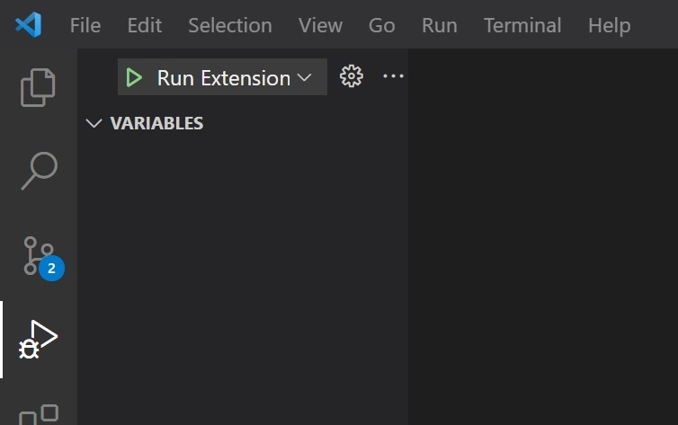

# Dryco

Dryco is a VS Code extension which can help users to write efficient code by detecting and refactoring similar block of code.

## Features

Dryco helps im keeping the code DRY(Don't Repeat Yourself), reliable and readable by shifting all repeated blocks of code in one file and importing them in target files.

<!-- For example if there is an image subfolder under your extension project workspace:

\!\[feature X\]\(images/feature-x.png\)

> Tip: Many popular extensions utilize animations. This is an excellent way to show off your extension! We recommend short, focused animations that are easy to follow. -->

<!-- ## Requirements
To install all npm dependencies and packages, run thin command on console:
> npm install -->

## Running Extension

After cloning this repo, open it in VSCode and install all npm dependencies or packages by running these commands on console:

> npm install

> npm run compile

After installing the required dependencies press `F5 key` and type `VS Code Extension Development` in search bar and press `Enter key` or you can can press `CTRL + F5` or go to the debug menu in VS Code Sidebar and select `Run Extension`.

Above operation will open the `Extension Development Host` and can be used to test the extension.

To run extension press `CTRL+SHIFT+P` and type `Detect Clone` to run the extension.

This will select all structurally similar code and provide VS Code Diagnostics with `Warning`.
Diagnostics also contains the locations of all the other instances of the same block of code in all the files of current directory.

User can also use the `Quick Fix` code action provided to move the block of code in `utilFunctions.js` file (If it does not exists, it creates a new file with this name). It removes all the instances of this block and adds an `import statement` at the required places.

<!-- ## Release Notes

Currently there is only one feature -->

### 1.0.0

Initial release of dryco

-----------------------------------------------------------------------------------------------------------
**Happy Hacking!**
